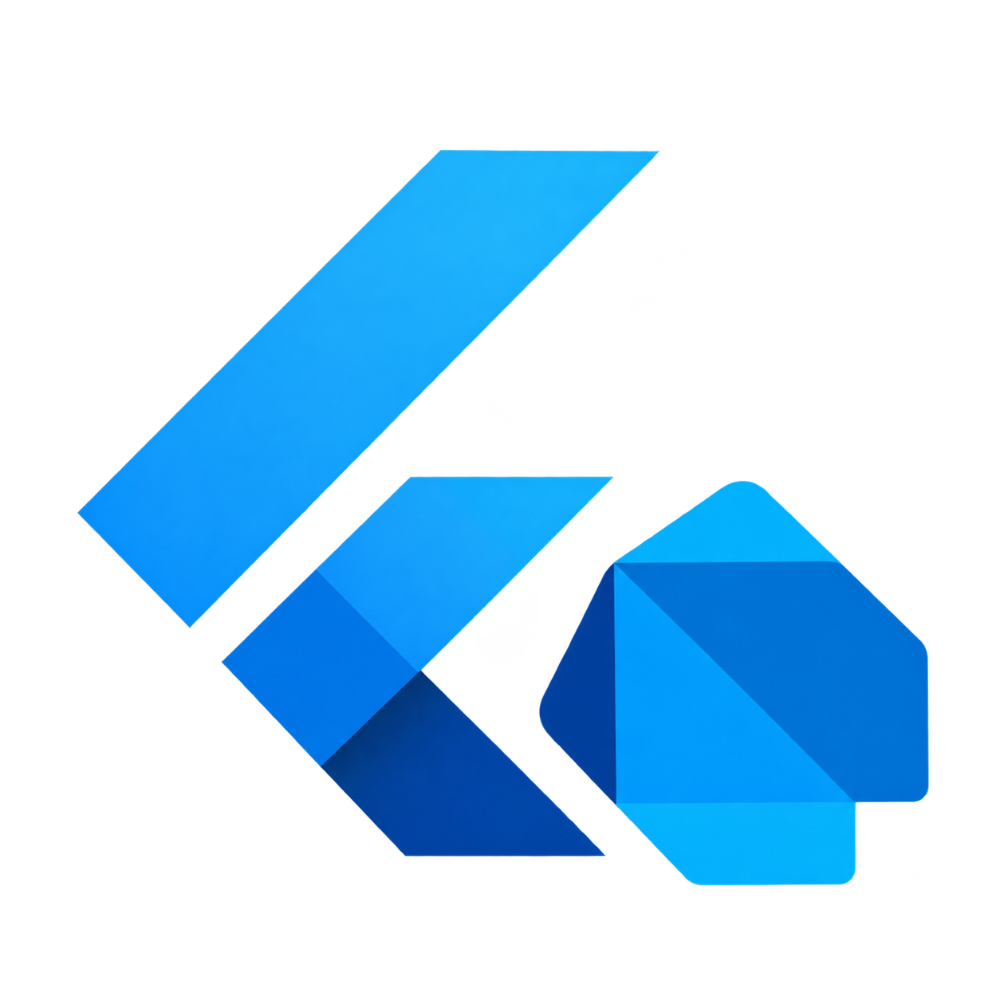

<p align="center">
  
</p>

<h1 align="center">flutter_fiber</h1>

<p align="center">
  <b>Real, procedural 3D for Flutter built from Dart data, not loaded from a file.</b><br>
  A native, declarative 3D widget package inspired by <a href="https://github.com/pmndrs/react-three-fiber">react-three-fiber</a>, rendered directly against OpenGL ES. No WebView. No bundled engine. No pre-baked asset.
</p>

<p align="center">
  <i>Logo built from the official Flutter and Dart brand marks to indicate framework compatibility. flutter_fiber is an independent, unofficial package and is not affiliated with or endorsed by Google, Flutter, or Dart.</i>
</p>

---

## What this actually is

Most "3D on Flutter" packages point a viewer at a `.glb`/`.gltf` file either through a WebView running three.js, or through a bundled native engine like Filament. That's great when you already have a finished 3D asset to show.

flutter_fiber is different: **every shape is Dart code**. Geometry, material, lighting, animation, and scale are all just parameters you set and change at runtime the same way you'd build any other Flutter widget tree. There's no asset pipeline, no exporter, no `.glb` file anywhere in the loop.

That means things that are awkward or impossible with a loaded-asset viewer are natural here:

- **Data-driven 3D tied to live app state** a fitness app's progress ring that thickens as the week's activity increases, a finance dashboard's shape that shifts color/roughness with portfolio risk, a habit tracker whose geometry visibly grows with a streak all driven by the same state that drives the rest of your UI.
- **Composable primitives** with `Fiber3DGroup`, chain multiple shapes into one rigid composite mesh (a capsule + two spheres = a limb; a cone + cylinder + sphere = a party hat) directly in widget code, animated as one unit or independently per-part.
- **A lightweight footprint** no bundled C++ rendering engine, no APK/IPA size or battery cost from an engine you're not using for anything else. Just a thin OpenGL ES binding and Dart-side math.
- **Full pipeline ownership** the whole render path (shader compilation, buffer upload, lighting, lifecycle) is plain Dart and GLSL you can read and fix yourself, not a black box you wait on someone else's engine team to patch.

If you already have a finished 3D model to show off, this isn't (yet) the package for that see [Roadmap](#roadmap). If you want 3D that behaves like the rest of your Flutter app, keep reading.

---

## Install

```
flutter pub add flutter_fiber
```

Or add manually to `pubspec.yaml`:

```yaml
dependencies:
  flutter_fiber: ^<latest_version>
```

**Platform support:** Android is the primary, fully supported target. iOS is experimental and physical-device-only (no simulator support Apple deprecated OpenGL ES; this mirrors the same caveat React Native's own OpenGL-based 3D libraries document).

---

## Quick start

A complete, working scene copy this into a fresh Flutter project's `main.dart` and run it:

```dart
import 'package:flutter/material.dart';
import 'package:flutter_fiber/src/renderer/fiber3d_canvas.dart';
import 'package:flutter_fiber/src/core/fiber3d_mesh.dart';
import 'package:flutter_fiber/src/core/fiber3d_vector3.dart';
import 'package:flutter_fiber/src/material/fiber3d_standard_material.dart';
import 'package:flutter_fiber/src/light/fiber3d_ambient_light.dart';
import 'package:flutter_fiber/src/light/fiber3d_point_light.dart';
import 'package:flutter_fiber/src/camera/fiber3d_camera.dart';
import 'package:flutter_fiber/src/geometry/fiber3d_torus_knot.dart';

void main() => runApp(const MyApp());

class MyApp extends StatelessWidget {
  const MyApp({super.key});

  @override
  Widget build(BuildContext context) {
    return MaterialApp(
      home: Scaffold(
        appBar: AppBar(title: const Text('flutter_fiber')),
        body: Fiber3DCanvas(
          backgroundColor: 0x1e1e1e,
          camera: Fiber3DCamera(
            position: const Fiber3DVector3(0, 0, 5),
            target: const Fiber3DVector3.zero(),
          ),
          orbitEnabled: true, // drag to orbit, pinch to zoom
          lights: [
            const Fiber3DAmbientLight(color: 0xffffff, intensity: 0.6),
            Fiber3DPointLight(
              color: 0xffffff,
              intensity: 3.0,
              position: const Fiber3DVector3(3, 4, 5),
            ),
          ],
          children: [
            Fiber3DMesh(
              geometry: Fiber3DTorusKnot(radius: 1.0, tube: 0.3),
              material: const Fiber3DStandardMaterial(
                color: 0x3366ff,
                roughness: 0.5,
                metalness: 0.2,
              ),
              onFrame: (elapsed, delta, transform) {
                final t = delta.inMicroseconds / 1e6;
                transform.rotation.y += t;
                transform.rotation.x += t * 0.4;
              },
            ),
          ],
        ),
      ),
    );
  }
}
```

That's it a lit, shaded, animated, orbit-controllable 3D object in well under the 15-line PRD target for the mesh itself.

---

## Shape gallery

Every shape below is generated live in `example/main.dart` clone the repo and run the example to page through all of them interactively, with live toggles for wireframe edges and flat/smooth shading.

Each demo clip is captured straight from that example app.

### Box

<video src="https://github.com/user-attachments/assets/816d9703-a490-42a3-a230-9df9afd35db4" width="360" controls></video>

```dart
Fiber3DBox(width: 1.4, height: 1.4, depth: 1.4)
```

### Capsule

<video src="https://github.com/user-attachments/assets/9d2b4dad-f03f-4cd6-8216-a97838ce9b29" width="360" controls></video>

```dart
Fiber3DCapsule(radius: 0.6, height: 1.2)
```

### Cone

<video src="https://github.com/user-attachments/assets/a23affa7-493a-43ea-854e-f88dac19707f" width="360" controls></video>

```dart
Fiber3DCone(radius: 1.0, height: 1.8, radialSegments: 32)
```

### Cylinder

<video src="https://github.com/user-attachments/assets/859d089f-9436-456b-8189-a18da881dfc9" width="360" controls></video>

```dart
Fiber3DCylinder(radiusTop: 0.8, radiusBottom: 0.8, height: 1.8)
```

### Icosahedron

<video src="https://github.com/user-attachments/assets/b825db80-2876-48e8-8c6d-84785b1700b4" width="360" controls></video>

```dart
Fiber3DIcosahedron(radius: 1.2)
```

### Lathe (revolved profile)

<video src="https://github.com/user-attachments/assets/75ecacc4-ebfb-4939-80b9-91d33568a1b3" width="360" controls></video>

Revolves a 2D profile around the Y axis the same technique three.js uses for vases, bowls, and baskets. A profile that closes back to `x = 0` at both ends produces a solid lens shape; leaving one end open away from the axis produces an open vessel.

```dart
Fiber3DLathe(
  points: const [
    [0.0, -0.9],
    [0.5, -0.85],
    [0.85, -0.5],
    [0.95, 0.0],
    [0.85, 0.5],
    [0.5, 0.85],
  ],
  segments: 24,
)
```

### Ring

<video src="https://github.com/user-attachments/assets/f4a7d81c-bc89-493a-b9a0-cb8e293097a6" width="360" controls></video>

```dart
Fiber3DRing(innerRadius: 0.5, outerRadius: 1.2)
```

### Sphere

<video src="https://github.com/user-attachments/assets/aaf411ed-df9d-47b1-ac77-889bddb667a5" width="360" controls></video>

```dart
Fiber3DSphere(radius: 1.2)
```

### Torus (donut)

<video src="https://github.com/user-attachments/assets/df60846a-32e1-4297-9cef-9152884d3b5b" width="360" controls></video>

```dart
Fiber3DTorus(radius: 1.0, tube: 0.4)
```

### Torus Knot

<video src="https://github.com/user-attachments/assets/dfd2ec3f-2d49-4994-b9f6-e4eaa122659b" width="360" controls></video>

```dart
Fiber3DTorusKnot(radius: 1.0, tube: 0.3)
```

### Also available

`Fiber3DCircle`, `Fiber3DDodecahedron`, `Fiber3DPlane`, and `Fiber3DPolyhedron` see the source under `lib/src/geometry/` for their constructors.

> **Note on video rendering:** these `<video>` tags render on GitHub. pub.dev's README sanitizer does not render embedded video on pub.dev this section will show as plain code samples with the clips available in the GitHub repo instead.

---

## Combining shapes with `Fiber3DGroup`

Primitives aren't just decoration they're building blocks. Group several meshes to move, rotate, and scale them together as one composite object, the same way most real 3D content (in Blender, three.js, or any game engine) is actually built:

```dart
Fiber3DGroup(
  onFrame: (elapsed, delta, transform) {
    final t = delta.inMicroseconds / 1e6;
    transform.rotation.y += t; // spins the whole group as one rigid unit
  },
  children: [
    Fiber3DMesh(
      geometry: Fiber3DCapsule(radius: 0.5, height: 1.5),
      material: const Fiber3DStandardMaterial(color: 0x3366ff),
    ),
    // Individual meshes inside a group can still animate independently
    // group motion and per-mesh motion compose automatically.
  ],
)
```

Shapes can nest inside groups, and a mesh with no `onFrame` of its own simply rides along with its parent group's motion as shown below on this toy train example using shapes from flutter_fiber.

<video src="https://github.com/user-attachments/assets/9b6d6020-faa5-4cb9-8de5-ed99fd13e251" width="360" controls></video>

```dart
import 'dart:math';
import 'package:flutter/material.dart';
import 'package:flutter_fiber/src/renderer/fiber3d_canvas.dart';
import 'package:flutter_fiber/src/core/fiber3d_group.dart';
import 'package:flutter_fiber/src/core/fiber3d_mesh.dart';
import 'package:flutter_fiber/src/core/fiber3d_vector3.dart';
import 'package:flutter_fiber/src/material/fiber3d_standard_material.dart';
import 'package:flutter_fiber/src/light/fiber3d_ambient_light.dart';
import 'package:flutter_fiber/src/light/fiber3d_point_light.dart';
import 'package:flutter_fiber/src/camera/fiber3d_camera.dart';
import 'package:flutter_fiber/src/geometry/fiber3d_box.dart';
import 'package:flutter_fiber/src/geometry/fiber3d_cone.dart';
import 'package:flutter_fiber/src/geometry/fiber3d_cylinder.dart';

void main() {
  runApp(const FiberTrainDemo());
}

class FiberTrainDemo extends StatelessWidget {
  const FiberTrainDemo({super.key});

  @override
  Widget build(BuildContext context) {
    return MaterialApp(
      debugShowCheckedModeBanner: false,
      home: Scaffold(
        appBar: AppBar(
          title: const Text('flutter_fiber toy train (composed shapes)'),
          backgroundColor: const Color(0xFF828282),
        ),
        body: Fiber3DCanvas(
          backgroundColor: 0x87ceeb,
          camera: Fiber3DCamera(
            position: const Fiber3DVector3(0, 1.0, 7),
            target: const Fiber3DVector3(0, 0.3, 0),
          ),
          orbitEnabled: true,
          lights: [
            const Fiber3DAmbientLight(color: 0xffffff, intensity: 0.7),
            Fiber3DPointLight(
              color: 0xffffff,
              intensity: 3.0,
              position: const Fiber3DVector3(3, 4, 5),
            ),
            Fiber3DPointLight(
              color: 0xffffff,
              intensity: 1.2,
              position: const Fiber3DVector3(-3, 2, -2),
            ),
          ],
          children: const [_ToyTrain()],
        ),
      ),
    );
  }
}

/// Body (box) + nozzle (fat cylinder standing at the front, forming an
/// L/7 shape with the body) + nose cone at the nozzle's tip, plus
/// side-mounted wheel pairs. Whole group does a slow turntable spin;
/// each wheel also spins independently about its own axle.
class _ToyTrain extends StatelessWidget {
  const _ToyTrain();

  @override
  Widget build(BuildContext context) {
    return Fiber3DGroup(
      onFrame: (elapsed, delta, transform) {
        final t = delta.inMicroseconds / 1e6;
        transform.rotation.y += t * 0.3;
      },
      children: const [
        _TrainBody(),
        _TrainBoiler(),
        _Chimney(),
        // Axle 1 (front, under the boiler)
        _Wheel(axleX: 1.0, radius: 0.32, side: 1),
        _Wheel(axleX: 1.0, radius: 0.32, side: -1),

        // Axle 2 (rearmost, under the cab — biggest wheel)
        _Wheel(axleX: -0.9, radius: 0.5, side: 1),
        _Wheel(axleX: -0.9, radius: 0.5, side: -1),
        // Axle 3 (under the boiler)
        _Wheel(axleX: -0, radius: 0.32, side: 1),
        _Wheel(axleX: -0, radius: 0.32, side: -1),
      ],
    );
  }
}

/// The long box body the "longer side" that sits on the ground,
/// forming the base of the L/7 shape.
class _TrainBody extends StatelessWidget {
  const _TrainBody();
  @override
  Widget build(BuildContext context) {
    return Fiber3DMesh(
      geometry: Fiber3DBox(width: 1.6, height: 1.4, depth: 1.3),
      material: const Fiber3DStandardMaterial(
        color: 0xcc1111,
        roughness: 0.4,
        metalness: 0.3,
        flatShading: true,
      ),
      onFrame: (elapsed, delta, transform) {
        // Bottom of the cab sits flush at y=0 the same ground line
        // every wheel's top and the boiler's bottom sit on. Standing
        // taller than it is wide gives it an upright cab silhouette
        // instead of a squat box.
        transform.position.set(-0.9, 0.8, 0);
      },
    );

  }
}
/// The fat vertical cylinder standing at the front of the body — the
/// nozzle. Stands upright at the front edge, forming the upright stroke
/// of the L/7 shape.
/// The boiler — a horizontal cylinder forming the train's long front
/// section, joining the cab's front face.
class _TrainBoiler extends StatelessWidget {
  const _TrainBoiler();
  @override
  Widget build(BuildContext context) {
    return Fiber3DMesh(
      geometry: Fiber3DCylinder(
        radiusTop: 0.5,
        radiusBottom: 0.5,
        height: 2.0,
        radialSegments: 24,
      ),
      material: const Fiber3DStandardMaterial(
        color: 0xcc1111,
        roughness: 0.4,
        metalness: 0.3,
        flatShading: true,
      ),
      onFrame: (elapsed, delta, transform) {
        // Rotating -90° about Z swings the cylinder's local Y axis (its
        // default long axis) onto global +X, laying it on its side so
        // it points forward instead of standing upright like a silo.
        transform.rotation.z = -pi / 2;
        // Bottom flush at y=0 (radius=0.5 → center at y=0.5), same
        // ground line as the cab. x=0.6 overlaps the cab's front face
        // slightly for a snug join.
        transform.position.set(0.6, 0.5, 0);
      },
    );
  }
}

/// The chimney a small nested Fiber3DGroup of its own (a thin
/// cylinder + a cone), sitting on top of the boiler near its front.
/// Demonstrates a group nested inside another group.
class _Chimney extends StatelessWidget {
  const _Chimney();
  @override
  Widget build(BuildContext context) {
    return Fiber3DGroup(
      children: [
        Fiber3DMesh(
          geometry: Fiber3DCylinder(
            radiusTop: 0.12,
            radiusBottom: 0.14,
            height: 0.35,
            radialSegments: 16,
          ),
          material: const Fiber3DStandardMaterial(
            color: 0x1a1a1a,
            roughness: 0.5,
            metalness: 0.4,
            flatShading: true,
          ),
          onFrame: (elapsed, delta, transform) {
            // Boiler top surface sits at y=1.0 (center 0.5 + radius 0.5).
            transform.position.set(1.0, 1.175, 0);
          },
        ),
        Fiber3DMesh(
          geometry: Fiber3DCone(radius: 0.16, height: 0.18, radialSegments: 16),
          material: const Fiber3DStandardMaterial(
            color: 0x1a1a1a,
            roughness: 0.5,
            metalness: 0.4,
            flatShading: true,
          ),
          onFrame: (elapsed, delta, transform) {
            transform.position.set(1.0, 1.44, 0);
          },
        ),
      ],
    );
  }
}
/// One side-mounted wheel: a cylinder tilted 90° about X so its flat
/// circular faces point sideways (±Z) instead of up/down — the "real
/// car tire" orientation, sticking out from the body's side. `side` is
/// +1 (right) or -1 (left). Spins continuously about its own axle.
class _Wheel extends StatelessWidget {
  final double axleX;
  final double radius;
  final int side; // +1 right, -1 left

  const _Wheel({
    required this.axleX,
    required this.radius,
    required this.side,
  });

  @override
  Widget build(BuildContext context) {
    const wheelThickness = 0.28;
    const bodyHalfDepth = 0.5; // both the cab and boiler are 1.0 deep

    return Fiber3DMesh(
      geometry: Fiber3DCylinder(
        radiusTop: radius,
        radiusBottom: radius,
        height: wheelThickness,
        radialSegments: 20,

      ),
      material: const Fiber3DStandardMaterial(
        color: 0x1a3d33,
        roughness: 0.5,
        metalness: 0.3,
        flatShading: true,
        
      ),
      onFrame: (elapsed, delta, transform) {
        final z = side * (bodyHalfDepth + wheelThickness / 2);
        // Wheel top flush at y=0 — the same ground line the cab and
        // boiler bottoms sit on — so every wheel looks properly seated
        // regardless of its own radius, big or small.
        final y = radius;
        transform.position.set(axleX, y, z);
        // Fixed 90° tilt so the cylinder's axis points along Z instead
        // of Y reorienting the disc to face sideways.
        transform.rotation.x = pi / 2;

        // Continuous spin about the wheel's own axle, applied in the
        // object's local frame before the tilt above this is what
        // makes it visually roll rather than wobble.
        final t = delta.inMicroseconds / 1e6;
        transform.rotation.y += t * 4;
      },
    );
  }
  // Comnine shapes  or custom shapes into what you want pure dart code called inside widget tree
}
```


---

## Key API options

| Option | Where | What it does |
|---|---|---|
| `showEdges: true / false` | `Fiber3DMesh` | Draws a second, unlit wireframe pass over the shaded surface the "shaded fill + visible edges" look seen in three.js's own geometry viewers. Ignored if the material's `wireframe` is already `true` (that mode is lines-only). |
| `material.wireframe: true / false` | `Fiber3DStandardMaterial` / `Fiber3DBasicMaterial` | Renders lines only, no filled triangles. |
| `material.flatShading: true / false` | `Fiber3DStandardMaterial` | `false` (default): smooth, interpolated per-vertex normals. `true`: one flat normal per triangle the faceted, low-poly "gem" look. Pure shading-mode toggle; the underlying geometry data is untouched. |
| `enablePinchScale: true / false` | `Fiber3DMesh` | Opt-in two-finger pinch-to-scale on that mesh, off by default. Anchored to the scale at gesture start so it never compounds mid-gesture. |
| `minPinchScale` / `maxPinchScale` | `Fiber3DMesh` | Clamps how far pinch-to-scale can shrink or grow the mesh. |
| `skyColor` / `groundColor` | `Fiber3DCanvas` | A cheap fake-environment light (same technique as three.js's `HemisphereLight`) blends two flat colors by each surface's normal direction so undersides aren't pure black. Not a rendered sky or ground plane, purely a lighting tint. Pass `0x000000` / `0x000000` to disable. |
| `orbitEnabled: true / false` | `Fiber3DCanvas` | Drag to orbit the camera, pinch to zoom, when no mesh under the gesture claims it first. |

---

## Lifecycle

`Fiber3DCanvas` manages its own GPU and battery cost automatically:

- Rendering pauses when the canvas scrolls off-screen, and resumes when it's visible again.
- Rendering pauses when the app is backgrounded, and resumes on foreground.
- The render loop fully stops (not just throttles) once nothing is animating and no gesture is in progress, and wakes on the next `onFrame` registration or touch.
- All GPU resources (buffers, shaders, the GL context itself) are released on dispose no manual cleanup required.

---

## Roadmap

- **GLTF/GLB loading** reading a `.glb`'s JSON + binary buffers directly into the same `positions` / `normals` / `indices` format the procedural geometry classes already produce, so a loaded mesh and a procedural mesh are indistinguishable once in buffer form. No changes to the existing render pipeline required.
- **Text and logo extrusion** a 2D path/curve subsystem (the same category of work behind three.js's `ExtrudeGeometry`/`TextGeometry`) to turn a font outline or SVG-style shape into a real 3D object, procedurally, at runtime.
- Additional PBR material features (clearcoat, sheen, transmission) and a baked-cubemap environment-lighting tier, once loaded-texture infrastructure exists.

---

## License

MIT free to use, modify, and ship in commercial products. See [LICENSE](LICENSE).

---

## Author

Built by **Darwin** ([CoCoNuT-sTuDiOs](https://github.com/CoCoNuT-sTuDiOs)).


